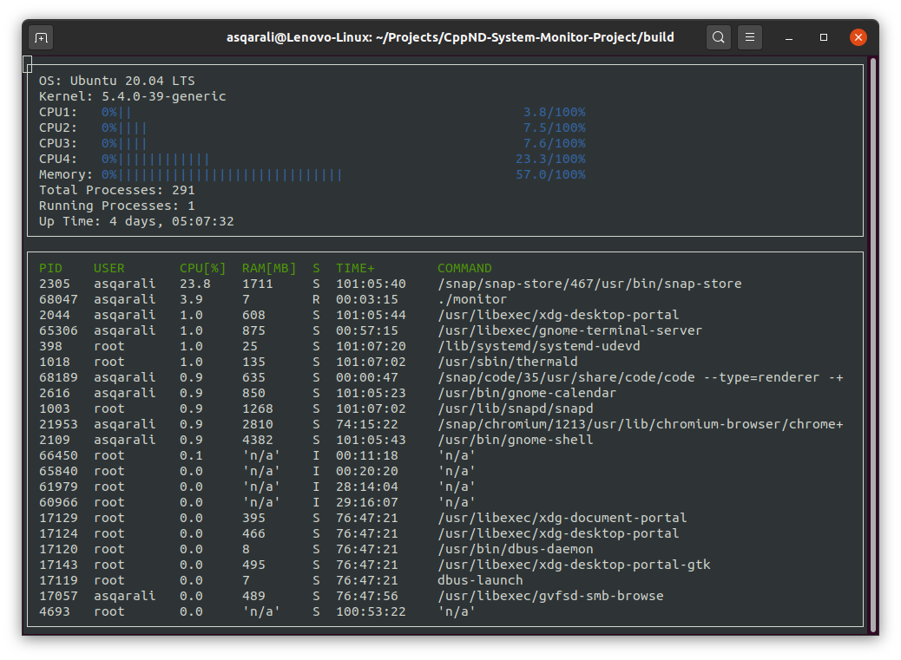

# CppND-System-Monitor

System Monitor Project for Object Oriented Programming Course of the [Udacity C++ Nanodegree Program](https://www.udacity.com/course/c-plus-plus-nanodegree--nd213). 

## Dependencies required to build (on Linux environment)
* cmake >= 2.6
  * [Click here for installation instructions](https://cmake.org/install/)
* make >= 4.1
  * make is installed by default on most Linux distros
* gcc/g++ >= 9.2
  * gcc/g++ is installed by default on most Linux distros
* ncurses
  * [ncurses](https://www.gnu.org/software/ncurses/) is installed using `sudo apt install libncurses5-dev libncursesw5-dev` command

## Instructions to build

1. Clone the project repository: `git clone https://github.com/askarali82/CppND-System-Monitor-Project.git`

2. Create a build directory and `cd` there: `mkdir build && cd build`

3. Build: `cmake ..`

4. Run the resulting executable: `./monitor`